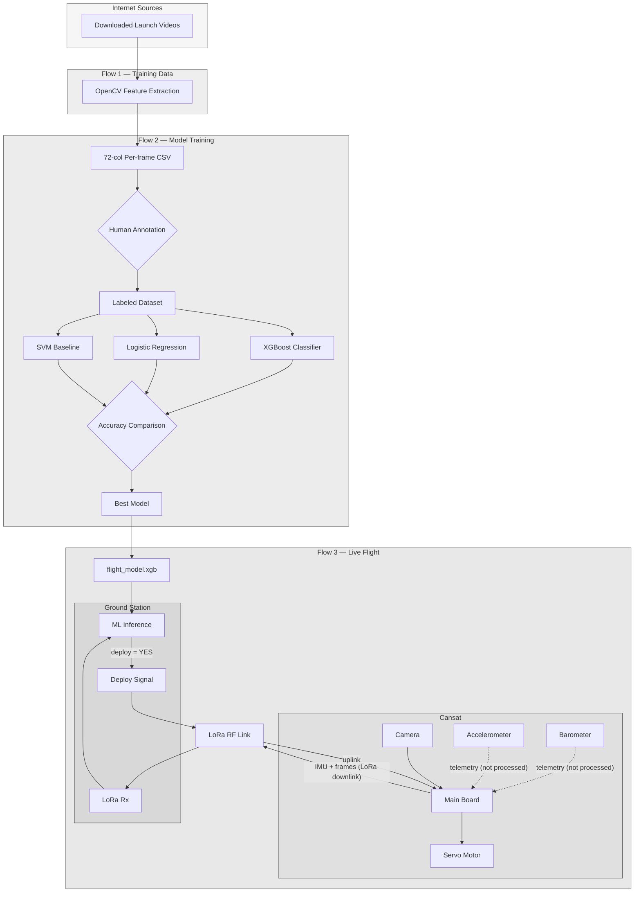
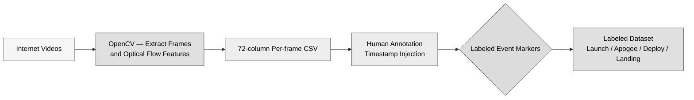
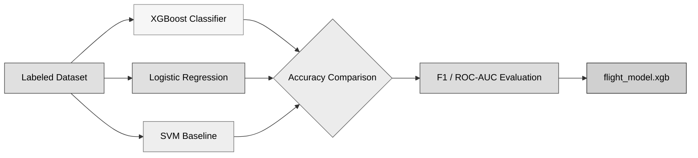
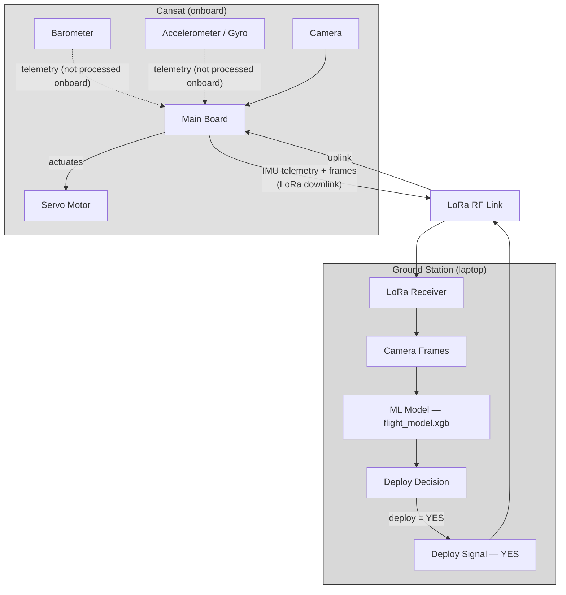
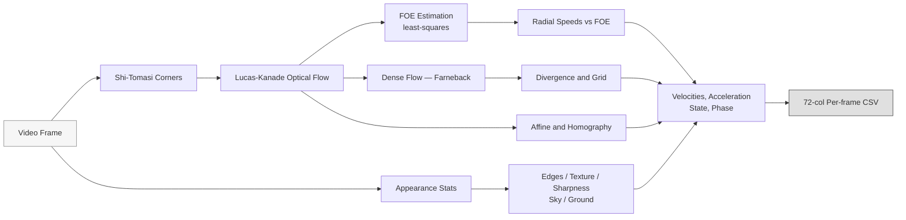

# Vision Based Landing Detection system

Vision-only apogee and leg-deployment timing for CanSat descent. Which the model only takes the cansat's
vision as the input while taking accelerometer and barometer post launch reference to determine te accuracy of the model during field deployment. Due to the restriction of cansat weight and cost of on-boarding module, LoRa is used as both up and downlink to recieve camera data as well as signal to deploy the leg based from ground. Laptop receives the camera data and IMU data from the cansat and processes it using the trained model to determine the right moment to deploy the leg. 

---

## Architecture Overview



---

## Flow 1 — Training Data Pipeline



---

## Flow 2 — Model Training



---

## Flow 3 — Live Flight Operation


## Feature extraction Pipeline



---

## Quick start

```bash
git clone https://github.com/7-wwh/AeroNottsCanSat-Landing-Detect.git 
cd AeroNottsCanSat-Landing-Detect
pip install -r requirements.txt

# 1. Extract vision features from a flight video → annotated video + CSV + plot
python rocket_flow.py flight.mp4

# 2. Train the model on your labeled dataset (after manual annotation)
python flight_ops/trainer.py data/labeled/flight_dataset.csv

# 3. Run ground station on flight day
python flight_ops/receiver.py --model flight_model/model.xgb
```

### Useful `rocket_flow.py` flags

| Flag | Purpose |
|------|---------|
| `--scale 0.5` | Process at half resolution (faster) |
| `--max-corners 500` | Max Shi-Tomasi corners to track |
| `--thresh 0.1` | Radial speed threshold for state classification |
| `--smooth 15` | Savitzky-Golay window for velocity smoothing |
| `--no-dense` | Skip Farneback dense flow (faster) |
| `--draw-foe` | Draw the Focus of Expansion crosshair |
| `--synthetic out.mp4` | Generate a test video (expansion→contraction) |

---

## Feature extraction

Each frame yields 72 features across 8 families, all written to the CSV:

| Family | Columns | Source |
|--------|---------|--------|
| Time + Labels | 3 | `time_s`, `state`, `phase` |
| Sparse radial | 6 | Mean/median/std/p95 radial speed about the FOE |
| Displacement | 4 | Tracked-point motion distance stats |
| Cloud distribution | 4 | Point count, density, spread |
| Direction histogram | 8 | 8-bin flow direction compass |
| FOE | 2 | Smoothed focus-of-expansion coordinates |
| Dense flow | 28 | Farneback magnitude, divergence, 3×3 grid |
| Camera ego-motion | 24 | Affine + homography + residual flow |
| Appearance | 6 | Edges, texture, sharpness, sky/ground |
| Horizon | 3 | Hough-line horizon angle/position/confidence |
| Temporal | 2 | Smoothed expansion rate + acceleration |

See [`video input/csv output/CSV_COLUMN_REFERENCE.md`](video%20input/csv%20output/CSV_COLUMN_REFERENCE.md)
for a full column-by-column walkthrough.

---

## Project structure

```
AeroNottsCanSat-Landing-Detect/
├── README.md                 ← this file
├── rocket_flow.py            ← CLI: video → 72-col CSV + annotated video
├── flight_ops/
│   ├── trainer.py            ← XGBoost + baselines, model selection
│   ├── receiver.py           ← LoRa ground station + ML inference loop
│   └── servo_controller.py   ← sends deploy signal via LoRa uplink
├── scripts/                  ← vision feature extraction library
│   ├── io.py                 ← video I/O, output paths
│   ├── state.py              ← flight-phase classification
│   ├── schema.py             ← 72-column CSV schema
│   ├── draw.py               ← HUD, trails, FOE crosshair
│   ├── synth.py              ← synthetic test-video generator
│   ├── plot.py               ← metrics visualization
│   └── features/
│       ├── sparse.py         ← Shi-Tomasi, LK, FOE, radial speed
│       ├── dense.py          ← Farneback divergence, grid, magnitude
│       ├── camera.py         ← affine + homography ego-motion
│       ├── appearance.py     ← edges, texture, sharpness, sky/ground
│       └── horizon.py        ← Hough horizon (experimental)
└── video input/
    └── csv output/           ← generated CSVs, FEATURES.md, CSV_COLUMN_REFERENCE.md
```

---

## Live flight setup

**Hardware** — five peripherals on the cansat's main board:

| Component | Role |
|-----------|------|
| Barometer | Altitude telemetry (streamed, not processed onboard) |
| Accelerometer/Gyro | IMU telemetry (streamed, not processed onboard) |
| LoRa Radio | Downlink (IMU + frames → ground) + uplink (deploy signal → cansat) |
| Camera | Captures frames for vision processing |
| Servo Motor | Deploys shock-absorbing legs (actuated locally by cansat board) |

**Deploy logic** — The XGBoost model evaluates each incoming frame. When
`radial_expansion` plateaus and `ground_fraction` rises (cansat is in the final
moments before ground contact), it emits a deploy signal. The ground station
sends a single-bit "YES" via LoRa uplink; the cansat board drives the servo
locally and cuts power immediately after actuation to prevent jitter.

---

## License

MIT — see [`LICENSE`](LICENSE).

---

*Built by the AeroNotts Rocketry team.*
