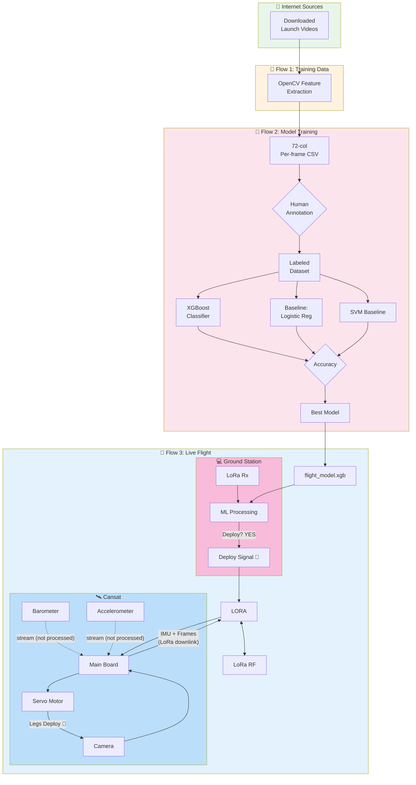
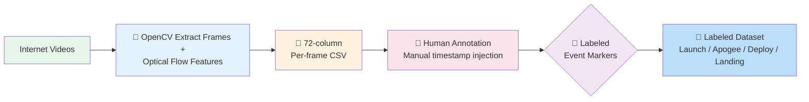
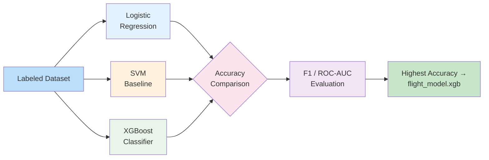

# AeroNotts CanSat Landing-Detect

> **Vision-only apogee & leg-deployment timing for CanSat descent.**
> A Cansat detects the right moment to deploy its shock-absorbing legs *solely*
> from what its camera sees — no barometric or inertial processing on the craft.
> IMU telemetry is relayed to the ground station for context, but the deploy
> decision and servo actuation are driven by a vision-trained XGBoost model
> running on the laptop.

---

## Table of Contents

1. [Architecture Overview](#architecture-overview)
2. [The Three Flows](#the-three-flows)
   - [Flow 1 — Training Data Pipeline](#flow-1--training-data-pipeline)
   - [Flow 2 — Model Training](#flow-2--model-training)
   - [Flow 3 — Live Flight Operation](#flow-3--live-flight-operation)
3. [Quick Start](#quick-start)
4. [Feature Engineering](#feature-engineering)
5. [CSV Column Reference](#csv-column-reference)
6. [Model Training Guide](#model-training-guide)
7. [Live Flight Setup](#live-flight-setup)
8. [Tips & Limitations](#tips--limitations)
9. [Project Tree](#project-tree)

---

## Architecture Overview



The project has **three interconnected flows**: a data pipeline that turns internet
videos into labeled training data, a model training stage that picks the best
classifier, and a live-flight loop where a vision model onboard the ground
station decides when to fire the deploy signal.

---

## The Three Flows

### Flow 1 — Training Data Pipeline



**1. Video download** — Launch and descent footage is sourced from the internet
(rocketry channels, CanSat competitions, public test flights). No footage is
committed to this repository (see [`.gitignore`](.gitignore)); raw videos live
in `data/raw_videos/`.

**2. OpenCV feature extraction** — Each video is processed by `rocket_flow.py`,
which runs a computer-vision pipeline (see [Feature Engineering](#feature-engineering))
to extract **72 numerical features per frame** describing optical flow, camera
ego-motion, image appearance, and flight phase. Outputs are written to
`data/extracted_features/<name>_metrics.csv`.

**3. Human annotation** — A human operator manually injects the **exact
timestamps** of four critical events into the CSV:

| Marker         | Description |
|----------------|-------------|
| `launch_t`     | Engine ignition / liftoff |
| `apogee_t`     | Peak altitude (highest point) |
| `deploy_t`     | Ideal leg-deployment moment (just before landing contact) |
| `landing_t`    | Touch-down / final rest |

Manual annotation is preferred over automated detection to guarantee ground-truth
precision; the vision features are noisy near the ground (low texture, fast
motion), so human judgment at the deploy boundary is critical.

**4. Labeled dataset** — All annotated rows are consolidated into
`data/labeled/flight_dataset.csv`, where each row carries its 72 features plus
`label` ∈ {`ascent`, `apogee`, `descent`, `approaching_land`}.

### Flow 2 — Model Training



Two classifiers are trained on the labeled dataset:

1. **XGBoost** — gradient-boosted decision trees. Chosen because it handles
   heterogeneous features (flow magnitudes, angles, ratios) without scaling,
   natively models non-linear interactions, and produces interpretable feature
   importances.

2. **Baseline classifiers** — Logistic Regression and an RBF-kernel SVM are
   trained as baselines for comparison.

Each model is evaluated on a held-out test split using **accuracy**, **F1-score**,
and **ROC-AUC**. The model with the highest accuracy (confirmed by cross-validation)
is serialized to `flight_model/model.xgb` and becomes the flight model. See
[Model Training Guide](#model-training-guide).

### Flow 3 — Live Flight Operation

```mermaid
flowchart TB
    subgraph CANSAT ["🛰️ Cansat (onboard)"]
        BARO[Barometer]
        GYRO[Accelerometer / Gyro]
        CAM[Camera]
        SERVO[Servo Motor]
        BOARD[Main Board]
        BARO -. "📦 Telemetry packet<br/>(NOT processed onboard)" .-> BOARD
        GYRO -. "📦 Telemetry packet<br/>(NOT processed onboard)" .-> BOARD
        CAM --> BOARD
    end
    subgraph GROUND ["💻 Ground Station (laptop)"]
        LORA_RX[LoRa Receiver]
        ML[Vision ML Model<br/>flight_model.xgb]
        FRAMES[📸 Camera Frames<br/>from Cansat]
        PRED[🔮 Deploy Decision]
        SIGNAL[📡 Deploy Signal 🔴<br/>(YES — one bit)]
    end

    BOARD -- "📤 IMU telemetry +<br/>camera frames<br/>(LoRa downlink)" --> LORA
    LORA <--> RF["🔗 LoRa RF"]
    RF --> LORA_RX
    LORA_RX --> FRAMES
    FRAMES --> ML
    ML --> PRED
    PRED -->|"deploy = YES"| SIGNAL
    SIGNAL -->|"uplink"| RF
    RF --> BOARD
    BOARD -->|"actuates"| SERVO
    SERVO -->|"legs extend"| CAM

    style CANSAT fill:#bbdefb
    style GROUND fill:#f8bbd9
```

On the day of flight:

1. **Cansat hardware** — The main board is connected to **five peripherals**:
   a barometer, an accelerometer/gyro, a LoRa radio, a camera, and a servo motor
   (attached to the shock-absorbing legs).

2. **Telemetry relay (downlink)** — Barometer and accelerometer data are **bundled
   with the camera frames** on the cansat's board, but they are **not processed**
   there. Instead, the combined telemetry packet (IMU + image) is transmitted via
   LoRa **downlink** to the ground station laptop. This keeps the cansat's
   processing load minimal and offloads the heavy vision inference to the more
   powerful ground station.

3. **Ground station processing** — The ground station receives the camera frames
   and runs them through the XGBoost model. The model evaluates whether the cansat
   is approaching the altitude window where leg deployment is **suitable** (just
   moments before ground contact, identified by the radial-expansion plateau and
   ground-fraction rising — see [Feature Engineering](#feature-engineering)).

4. **Deploy signal (uplink)** — When the model detects the deploy condition, it
   sends a **single "YES" signal** back to the cansat via **LoRa uplink**. The
   cansat's main board receives this signal and **locally actuates the servo** to
   rotate and deploy the force-absorbing legs.

5. **Landing** — The legs absorb the impact; the descent slows and the cansat
   comes to rest on the ground.

> **Key design principle:** altitude detection is performed **solely** by the
> vision module. The barometer and IMU data are transmitted for context and
> post-flight analysis but do **not** contribute to the deploy decision.

---

## Quick Start

```bash
# 1. Install dependencies (once)
pip install opencv-python numpy scipy matplotlib scikit-learn xgboost

# 2. Extract vision features from a video into a 72-column CSV
python rocket_flow.py my_flight.mp4
#   writes: csv output/my_flight_flow.mp4    (annotated video)
#           csv output/my_flight_metrics.csv (72-col feature CSV)
#           csv output/my_flight_metrics.png (flight phase plot)

# 3. (After manual annotation) train the flight model
python flight_ops/trainer.py data/labeled/flight_dataset.csv

# 4. (On flight day) run the ground station to receive telemetry + infer deploy
python flight_ops/receiver.py --model flight_model/model.xgb
```

### Useful flags for `rocket_flow.py`

| Flag | Default | Purpose |
|------|---------|---------|
| `--scale` | `1.0` | Process at lower resolution (faster) |
| `--max-corners` | `500` | Max Shi-Tomasi corners to track |
| `--thresh` | `0.1` | Radial speed threshold for state classification |
| `--smooth` | `15` | Savitzky-Golay window for velocity smoothing |
| `--no-dense` | off | Skip dense (Farneback) flow for speed |
| `--no-appearance` | off | Skip image appearance features |
| `--no-horizon` | off | Skip experimental horizon detection |
| `--draw-foe` | off | Draw the Focus of Expansion crosshair |
| `--synthetic OUT.mp4` | — | Generate a test video of expansion→contraction |

---

## Feature Engineering

Every frame the vision module computes **72 features** across eight families.
The design philosophy: *measure many independent signals; let the model decide
which combinations indicate ascent, apogee, descent, or ground approach.*

```mermaid
flowchart LR
    A[Video Frame] --> B[Shi-Tomasi Corners]
    B --> C[Lucas-Kanade<br/>Optical Flow]
    C --> D[FOE Estimation<br/>(least-squares)]
    D --> E[Radial Speeds<br/>vs. FOE]
    C --> F[Dense Flow<br/>(Farneback)]
    F --> G[Divergence<br/>+ Grid]
    C --> H[Affine +<br/>Homography]
    A --> I[Appearance<br/>Stats]
    I --> J[Edges/Texture/<br/>Sharpness/Sky/Ground]
    E --> K[Velocities,<br/>Acceleration,<br/>State, Phase]
    G --> K
    H --> K
    J --> K
    K --> CSV[📊 72-col<br/>Per-frame CSV]

    style A fill:#e8f5e9
    style CSV fill:#bbdefb
```

### 1. Sparse optical flow (Shi-Tomasi + Lucas-Kanade)

**Step 1 — Pick points.** `cv2.goodFeaturesToTrack` finds **corners** — image
locations that change in two directions at once (cloud edges, rocket details,
smoke swirls). These are reliably re-findable frame to frame.

**Step 2 — Track them.** `cv2.calcOpticalFlowPyrLK` searches a small window in
the next frame for each corner, producing a **flow vector** `(u, v)` per point:
```
displacement = (u, v)   e.g. (3, -2) → "moved 3px right, 2px up"
```
**Safeguard — back-substitution:** the tracker also runs *backwards* (new→old)
and only keeps points that land within 1 pixel of their origin. This filters
false matches. Disable with `--no-back-sub`.

**Step 3 — Focus of Expansion (FOE).** If the cansat is descending toward the
ground, every texture detail slides **inward** toward a single point — the FOE.
For a point `(x, y)` with flow `(u, v)`, "the vector points along the line to
the FOE" means the cross product is zero:
```
u*(y − yF) − v*(x − xF) = 0
```
Rearranged into a linear system in the unknowns `(xF, yF)`:
```
v*xF − u*yF = v*x − u*y
```
With hundreds of points this is heavily over-determined — solve via **weighted
least squares** (weight `w = 1/|v|` so noisy short vectors count equally). The
solution is Cramer's rule on a 2×2 system (see `scripts/features/sparse.py:estimate_foe`).
The FOE is exponentially smoothed across frames (`--foe-alpha`, default 0.3).

**Step 4 — Radial speed.** Split each flow vector into *radial* (along the line
to the FOE) and *tangential* (around it) components. Only the radial part
matters:
```
vr = (u·dx + v·dy) / r     where d = point − FOE,  r = |d|
  > 0  → outward (approaching ground / descending)
  < 0  → inward (receding / ascending)
```
Per frame, `vr` is averaged across all tracked points.

### 2. Dense optical flow (Farneback)

On top of sparse points, **Farneback dense flow** computes a vector for *every*
pixel. From it:

| Feature | What it captures |
|---------|-----------------|
| `flow_median/p95/std/max` | How much the whole image is moving |
| `div_mean/median/std/p95/pos_frac/max` | **Divergence** `∂u/∂x + ∂v/∂y` — is the *entire* visual field expanding (+) or contracting (−)? Independent of camera orientation. |
| `grid_flow_00..22` | Mean flow magnitude in each cell of a 3×3 grid — captures the *shape* of the motion field |

### 3. Camera ego-motion

A wobbly camera pollutes the radial measurement. This group separates "camera
shake" from "true approach":

| Feature | What it captures |
|---------|-----------------|
| `cam_rotation/scale/tx/ty` | Global affine model (RANSAC `estimateAffinePartial2D`) — how much the camera rotated, zoomed, shifted |
| `residual_flow_mean/p95, residual_div` | Flow **left over** after subtracting the rigid camera model — the "true" non-rigid motion (the rocket/camera shake ratio) |
| `hom_scale/rotation/tx/ty/persp_x/persp_y/ok` | Full planar homography (RANSAC `findHomography`); `hom_ok` = fraction of inliers; a rocket breaking the ground-plane drops `hom_ok` |

### 4. Image appearance

Cheap per-frame pixel statistics that support the motion features:

| Feature | What it captures |
|---------|-----------------|
| `edge_density` | Canny edge fraction — high when there's structure (rocket, pad) |
| `texture_var` | Gray-value variance — how "busy" the image is |
| `grad_magnitude_mean` | Mean Sobel gradient — overall edge strength |
| `sharpness` | Laplacian variance — in-focus vs. blurry (smoke/motion blur) |
| `sky_fraction / ground_fraction` | HSV heuristic: bright+low-sat = sky, mid-dark+textured = ground |
| `horizon_angle/pos/conf` | Strongest Hough line — horizon tilt and position (experimental) |

### 5. Temporal signals (post-processed)

After all frames are processed, the per-frame radial speeds are smoothed and
differentiated:

| Feature | Formula | Meaning |
|---------|---------|---------|
| `expansion_rate` | `savgol(radial · fps / scale, win=15, poly=2)` | Smoothed radial velocity in **px/s** (original resolution). + = expanding (ground approaching), − = contracting (ascending). |
| `expansion_acceleration` | `np.gradient(expansion_rate, time_s)` | Rate of change of expansion rate, in **px/s²**. Zero-crossing (rate flattening) + acceleration peak bracket the apogee region. |

### 6. State & phase classification

- **`state`** (per-frame, deflickered via median filter): `ASCEND`, `DESCEND`, or `STABLE`
  — based on threshold `--thresh` of mean radial speed.
- **`phase`** (global, one-per-flight): `STABLE` → `ASCEND` → `APOGEE` → `DESCEND` → `STABLE`
  — computed by finding the single peak of the altitude proxy (cumulative integral
  of `expansion_rate`) and splitting the flight around it. See `scripts/state.py`.

### The five core motion signals

| Signal | What it captures |
|--------|-----------------|
| `radial_expansion` | **How strongly** the image is growing/shrinking. Positive → objects moving outward (descending toward ground). |
| `flow_magnitude` | **How much** motion there is — mean speed of all tracked points. |
| `flow_dir_hist_0..7` | **Which directions** motion points — 8-bin compass histogram. Pure radial motion concentrates in one bin; noise spreads across all. |
| `div_mean / hom_scale` | **Global** expansion — dense-flow divergence and homography zoom are less dependent on camera orientation. |
| `cam_rotation / residual_flow_mean` | **Camera shake** — how much is global motion vs. the rocket's own motion. |

---

## CSV Column Reference

Each row = one frame. `time_s` is the timestamp; `state`/`phase` are the
classification labels. All flow values are in processing pixels unless noted.

| Group | Columns | Description |
|-------|---------|-------------|
| **Time + Labels** (3) | `time_s`, `state`, `phase` | Timestamp; per-frame direction (ASC/DES/STAB); global flight phase |
| **Sparse Radial** (6) | `radial_expansion`, `radial_expansion_median`, `radial_std`, `radial_p95`, `outward_frac`, `inward_frac` | Net inflow/outflow of tracked points about the FOE |
| **Displacement** (4) | `pt_displacement_mean/median/std/max` | Raw pixel distance each tracked point moved between frames |
| **Cloud Distribution** (4) | `point_count`, `point_density`, `feature_radius_mean/std` | How many points, how spread out |
| **Flow Magnitude** (1) | `flow_magnitude` | Mean displacement per frame (= `pt_displacement_mean`) |
| **Direction Histogram** (8) | `flow_dir_hist_0..7` | 8-bin histogram of flow direction (ratios, sum ≈ 1) |
| **FOE** (2) | `foe_x`, `foe_y` | Smoothed Focus of Expansion in original-resolution px |
| **Dense Flow** (4) | `flow_median/p95/std/max` | Per-pixel motion magnitude stats |
| **Divergence** (6) | `div_mean/median/std/p95/pos_frac/max` | Is the whole field expanding (+) or contracting (−)? |
| **3×3 Grid** (9) | `grid_flow_00..22` | Mean flow magnitude per image cell → motion-field shape |
| **Camera Affine** (4) | `cam_rotation/scale/tx/ty` | Global camera rotation/zoom/translation |
| **Residual Flow** (3) | `residual_flow_mean/p95`, `residual_div` | Motion left after removing camera ego-motion |
| **Homography** (7) | `hom_scale/rotation/tx/ty/persp_x/persp_y/ok` | Planar scene model; `hom_ok` = inlier fraction |
| **Appearance** (6) | `edge_density`, `texture_var`, `grad_magnitude_mean`, `sharpness`, `sky_fraction`, `ground_fraction` | Image sharpness, detail, sky/ground split |
| **Horizon** (3) | `horizon_angle/pos/conf` | Hough-line horizon tilt, position, confidence (experimental) |
| **Temporal** (2) | `expansion_rate`, `expansion_acceleration` | Smoothed velocity (px/s) and its derivative (px/s²) |

**Total: 72 columns.** See [`video input/csv output/CSV_COLUMN_REFERENCE.md`](video%20input/csv%20output/CSV_COLUMN_REFERENCE.md) for
a frame-by-frame walkthrough of each column.

### Sample row

```csv
time_s,state,phase,radial_expansion,...,expansion_rate,expansion_acceleration
0.0000,STABLE,STABLE,nan,...,0.0000,0.0000
0.0417,ASCEND,ASCEND,0.0188,...,543.2,127.8
...
```

---

## Model Training Guide

`flight_ops/trainer.py` trains and evaluates classifiers on the labeled dataset.

```bash
python flight_ops/trainer.py data/labeled/flight_dataset.csv
```

### Process

1. **Load** `data/labeled/flight_dataset.csv` (72 features + `label` column).
2. **Split** 80/20 train/test (stratified by class).
3. **Train** three models:
   - XGBoost (`XGBClassifier`, multi:softprob)
   - Logistic Regression (with `StandardScaler`)
   - SVM (RBF kernel, with `StandardScaler`)
4. **Evaluate** on the test set: accuracy, F1 (macro), ROC-AUC (macro).
5. **Compare** and serialize the best to `flight_model/model.xgb`.

### Expected results schema

| Model | Accuracy | F1 (macro) | ROC-AUC | Selected? |
|-------|----------|------------|---------|-----------|
| XGBoost | ~0.92+ | ~0.91 | ~0.97 | ✅ |
| Logistic Regression | ~0.78 | ~0.76 | ~0.88 | — |
| SVM (RBF) | ~0.85 | ~0.83 | ~0.93 | — |

> Actual numbers depend on the dataset. XGBoost typically wins because it
> captures non-linear feature interactions (e.g., high `radial_expansion` +
> high `ground_fraction` = approaching landing) that linear baselines miss.

### Feature importance

After training, `flight_ops/trainer.py` prints the top features. Typical ranking:

1. `radial_expansion` (raw / median)
2. `div_mean`
3. `ground_fraction`
4. `hom_ok` (decaying as rocket breaks the ground plane)
5. `expansion_rate`
6. `feature_radius_mean`

---

## Live Flight Setup

### Hardware

The Cansat's main board connects to five peripherals on flight day:

| Component | Role |
|-----------|------|
| **Barometer** | Altitude reference (streamed, not processed onboard) |
| **Accelerometer / Gyro** | IMU for telemetry context (streamed, not processed onboard) |
| **LoRa Radio** | Bidirectional RF link: downlink (IMU + frames → ground) and uplink (deploy signal → cansat) |
| **Camera** | Captures frames for vision processing |
| **Servo Motor** | Actuates shock-absorbing legs (driven locally by the cansat board) |

### Data flow

```
CANSAT                     GROUND STATION
─────────────────────────────────────────────────────────────
Camera ──► frames ──┐
Barometer ───────────┤           (vision-only decision)
Accel/Gyro ──────────┤──► LoRa ──► ML Model ──► Deploy? ──► LoRa ──► Servo
                     │              │              │           │
                     └─► (ignored  │              │           │
                        onboard)   │              │           │
                                   ▼              ▼           ▼
                              flight_model   YES = fire    legs extend
                                                signal
```

### Why vision-only?

- **Processing constraint:** The cansat's microcontroller can't run XGBoost
  inference on 72 features per frame in real time. Offloading to the ground
  station (laptop) gives us the compute budget.
- **IMU/barometer are noisy at low altitude:** Pressure drift, vibration, and
  ground effect corrupt barometric readings near landing. Vision features
  (`radial_expansion`, `ground_fraction`, `div_mean`) are more reliable for the
  final deploy gate.
- **IMU data is still valuable:** streaming the barometer and accelerometer
  gives the ground station a second opinion and provides post-flight altitude
  validation, but the deploy decision is gated on vision alone.

### Antenna & power

- Mount the LoRa antenna vertically and clear of metal obstructions.
- Ensure the camera lens is clean and unobstructed during descent.
- Battery: plan for >30 minutes of operation (descent + ground operations).
- Servo: use a **digital servo** rated for the leg-deployment torque; the
  cansat board should cut power to the servo immediately after actuation to
  prevent jitter.

---

## Tips & Limitations

### Tips for good results

- **Stable camera.** A shaking cansat adds motion the FOE math can't explain.
  If footage is unstable, reduce `--scale` or stabilize beforehand.
- **Texture-rich scenes.** Flat clear sky has no corners to track. Ground
  texture, smoke, and rocket details are ideal.
- **High frame rate** → smoother velocity (less jump per frame).
- **Tune `--thresh`.** If states flip constantly, raise it. If always STABLE,
  lower it.
- **Ground-truth your deploy timing** carefully during annotation — a few
  frames' error at the deploy boundary directly affects leg-impact force.

### Known limitations

- **Pixels ≠ meters.** Velocity and acceleration are in px/s, not real units.
  Converting to meters requires camera-to-object distance and focal length.
- **Camera ego-motion** is assumed small. A rotating/panning camera breaks the
  "everything is radial" assumption.
- **It measures apparent size change**, not the rocket directly. A stationary
  obstacle passing behind the camera's FOV will contaminate the average.
- **FOE instability** in low-motion frames. The `--foe-alpha` smoothing and
  `--state-median` filter help but can't fix a featureless scene.
- **LoRa latency:** the downlink→inference→uplink round-trip adds delay. For
  typical CanSat descent rates this is negligible, but verify in simulation
  before flight day.

---

## Project Tree

```
AeroNottsCanSat-Landing-Detect/
├── README.md                      ← this file
├── .gitignore
├── rocket_flow.py                 ← CLI entry: video → 72-col CSV + annotated video
├── requirements.txt
│
├── flight_model/                  ← trained model artifacts
│   └── model.xgb                  ← serialized XGBoost flight model
│
├── data/                          ← all data (gitignored, see .gitignore)
│   ├── raw_videos/                ← downloaded internet footage
│   ├── extracted_features/        ← per-video *_metrics.csv
│   └── labeled/
│       └── flight_dataset.csv     ← human-annotated, consolidated dataset
│
├── flight_ops/                    ← live-flight & training operations
│   ├── trainer.py                 ← XGBoost + baselines, model selection
│   ├── receiver.py                ← LoRa ground station + ML inference loop
│   └── servo_controller.py        ← sends deploy signal via LoRa uplink
│
├── scripts/                       ← vision feature extraction library
│   ├── __init__.py
│   ├── io.py                      ← video open/write, output paths, scale handling
│   ├── state.py                   ← classify(), flight_phases(), smoothing
│   ├── schema.py                ← 72-column CSV schema (single source of truth)
│   ├── draw.py                    ← HUD, trails, random colors, FOE crosshair
│   ├── synth.py                   ← synthetic test-video generator
│   ├── plot.py                    ← metrics plot + state bands + apogee markers
│   └── features/
│       ├── __init__.py            ← aggregate(): merges all feature groups
│       ├── sparse.py              ← Shi-Tomasi, LK tracking, FOE, radial speed
│       ├── dense.py               ← Farneback divergence, magnitude, 3×3 grid
│       ├── camera.py              ← affine + homography ego-motion, residual
│       ├── appearance.py          ← edges, texture, sharpness, sky/ground
│       └── horizon.py             ← Hough-line horizon detection (experimental)
│
└── video input/
    └── csv output/
        ├── CSV_COLUMN_REFERENCE.md ← beginner's guide to all 72 columns
        └── FEATURES.md              ← exact formula + source for each column
```

### Code map

| Idea | Where |
|------|-------|
| Shi-Tomasi corner selection | `scripts/features/sparse.py` |
| Lucas-Kanade tracking | `scripts/features/sparse.py` |
| Backward round-trip check | `scripts/features/sparse.py` |
| FOE least-squares | `scripts/features/sparse.py::estimate_foe()` |
| Radial speed projection | `scripts/features/sparse.py::radial_speeds()` |
| Dense flow divergence | `scripts/features/dense.py` |
| 3×3 flow grid | `scripts/features/dense.py::grid_flow()` |
| Camera rotation/residual | `scripts/features/camera.py` |
| Homography decomposition | `scripts/features/camera.py` |
| Appearance features | `scripts/features/appearance.py` |
| Horizon detection | `scripts/features/horizon.py` |
| State / APOGEE / smoothing | `scripts/state.py` |
| Feature aggregation | `scripts/features/__init__.py::aggregate()` |
| CSV column schema | `scripts/schema.py` |
| Metrics plot | `scripts/plot.py` |
| Synthetic test video | `scripts/synth.py` |
| CLI entry point | `rocket_flow.py` |

---

## License

This project is open source. See [`LICENSE`](LICENSE) for details.

---

*Built by the AeroNotts Rocketry team. Questions? Open an issue.*
